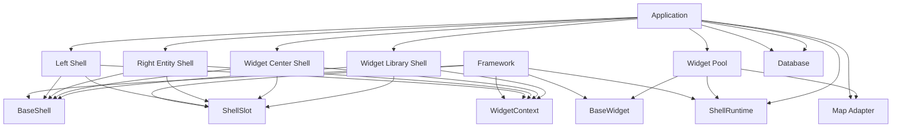
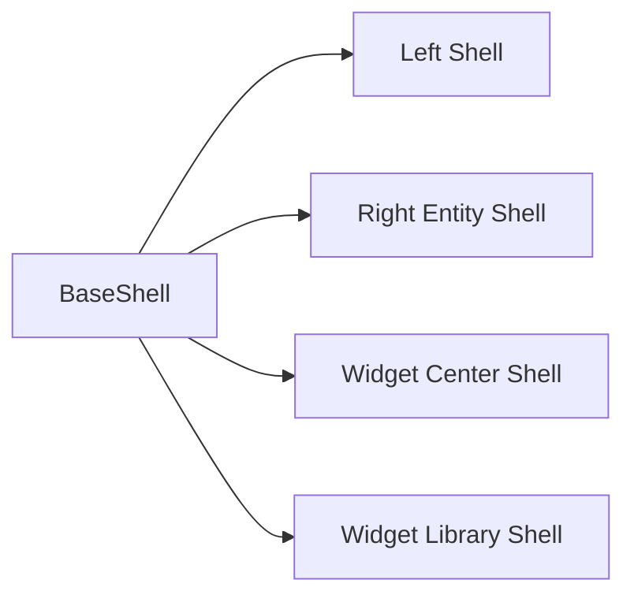
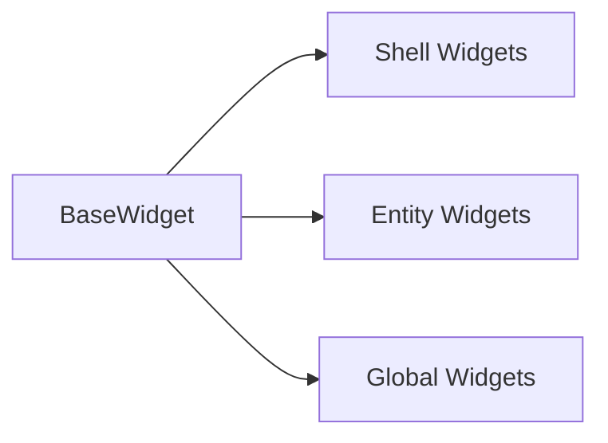
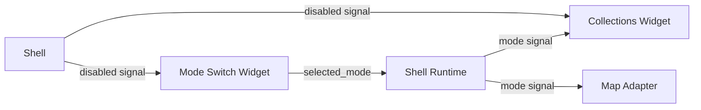
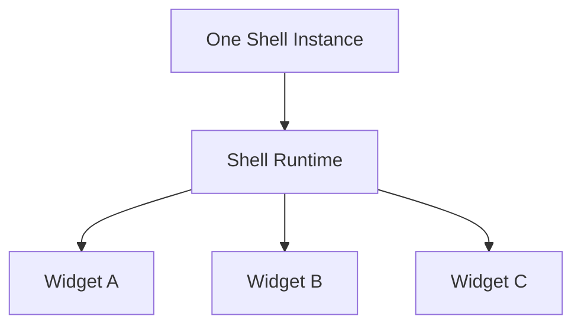
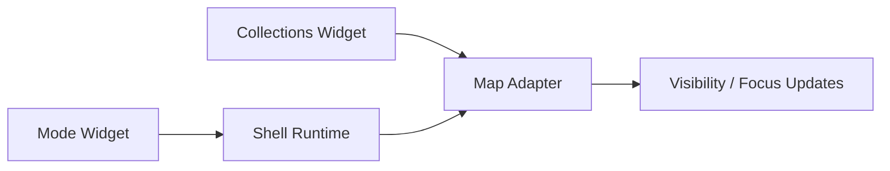
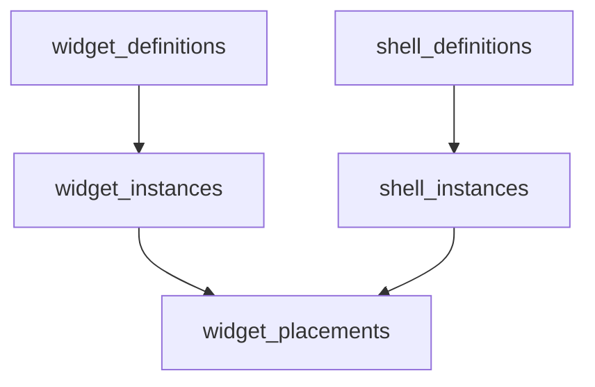
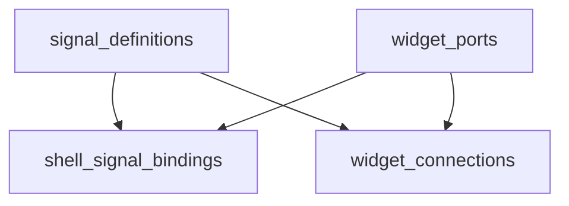
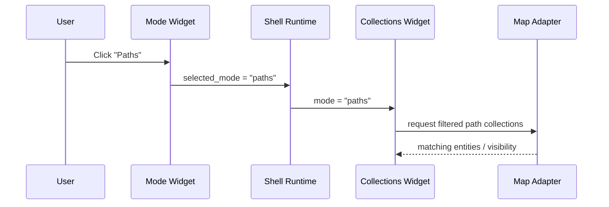

# Framework Blueprint

This file is the single high-level map of the application framework.

It describes:

1. what the framework is
2. what the application is
3. how shells, widgets, signals, map adapters, and the database relate
4. what is generic
5. what is application-specific

---

## 1. Human Model

The whole system should be understood like physical equipment.

- `Shell` = panel / rack / surface
- `Widget` = instrument / device
- `Signals` = wires
- `Connections` = explicit wiring
- `Map Adapter` = another device the app can connect to
- `App` = the orchestrator that decides how things are connected

The framework itself does **not** know the product.
It only knows how panels, widgets, and signals work in general.

---

## 2. The Big Picture

---

## 3. Main Rule

There are only two worlds.

### Framework world

Generic reusable atoms:

1. `BaseShell`
2. `BaseWidget`
3. `ShellRuntime`
4. `ShellSlot`
5. `WidgetContext`

### Application world

Concrete product composition:

1. left shell
2. right entity shell
3. widget center shell
4. widget library shell
5. collections widget
6. mode switch widget
7. map controls widget
8. rating widget
9. gallery widget
10. any future widget

Application code must **compose** framework atoms.
It must not invent parallel base systems.

---

## 4. Shell Model

`BaseShell` is the generic panel.

It knows only:

1. open / close
2. placement
3. motion
4. backdrop
5. scroll region
6. header region

It does **not** know:

1. pins
2. paths
3. collections
4. ratings
5. map business logic
6. product meaning of signals

### Concrete shells

Each concrete shell is only a specialization:

- title
- subtitle
- placement
- size
- allowed widget policies
- shell-specific orchestration

---

## 5. Widget Model

`BaseWidget` is the generic instrument.

It knows only:

1. frame
2. header
3. settings
4. host shell selector UI
5. standard shell-native behavior

It does **not** know:

1. where it will always live
2. what product it belongs to
3. what other widgets exist
4. what a signal means in product terms

### Concrete widgets

Examples:

- shell widgets:
  - search
  - mode switch
  - collections
  - controls
  - create collection
  - reset view
- entity widgets:
  - info
  - delete
  - rating
  - gallery
  - stories
  - resources
  - nearby pins
  - transport mode
- global widgets:
  - widget center cards
  - future dashboard widgets

---

## 6. One Species of Widget

There are not two biological kinds of widgets.

All widgets are one species.

Every widget should already know how to:

1. live inside a shell
2. be dragged by shell slot logic
3. be disabled by shell signals
4. open settings
5. read shell-native context

The difference is not in what widget **is**.

The difference is in how much extra orchestration it needs.

### Example

`rating`:
- can mostly live by standard shell behavior

`mode switch`:
- still the same species of widget
- but it becomes useful only when the app connects its signals to something meaningful

---

## 7. Signals

Signals are the wires.

They are generic values passed through shell runtime and connections.

Examples:

- `shell.disabled`
- `shell.hidden`
- `shell.mode`
- `shell.collection_query`
- `map.focus_entity`

### Signal flow

The key idea:

- widgets can emit signals
- widgets can consume signals
- shell can emit signals
- map adapter can consume and emit signals
- the app decides how they are connected

---

## 8. Two Levels of Widget Behavior

Every widget works on two levels.

### Level 1: shell-native behavior

Comes from the framework automatically:

1. host awareness
2. settings open/close
3. disable state
4. drag / reorder compatibility
5. shell lifecycle compatibility

### Level 2: product scenario behavior

Comes from application orchestration:

1. button 1 means `pins`
2. button 2 means `paths`
3. signal from widget A goes to widget B
4. signal from widget B goes to map
5. shell chooses who is locked during authoring flow

This second level is not framework logic.
This is application composition.

---

## 9. Shell Runtime

`ShellRuntime` is the shared local bus inside one shell.

It holds:

1. shell-scoped signals
2. shell-scoped state
3. shell capabilities
4. widget element registration
5. scroll targeting

It is local per shell.

That means:

- left shell has its own runtime
- right shell has its own runtime
- widget center has its own runtime
- library shell has its own runtime

---

## 10. Shell Slot

`ShellSlot` is the generic place where a widget is mounted inside a shell.

It owns:

1. drag affordance
2. drop target behavior
3. reorder visuals
4. shell-owned drag geometry

It does **not** belong to widgets.

Widgets should not reimplement drag/drop.

---

## 11. Widget Context

`WidgetContext` is shell-owned widget metadata.

Examples:

1. current host shell
2. allowed host options
3. whether host selection is locked
4. optional host change callback

This is not widget business logic.
This is shell-to-widget context.

---

## 12. Map Adapter

The map is a separate integration device.

It should be treated like another system with inputs and outputs.

The framework should not hardcode map meaning into `BaseWidget` or `BaseShell`.

Instead:

- app widgets can connect to a map adapter
- app shells can also publish signals the map listens to

---

## 13. Database Model

The backend must mirror the same framework model.

### Core records

This answers:

1. what widget is this
2. what shell is this
3. where is the widget placed

### Signal records

This answers:

1. what signals exist
2. what ports widgets have
3. what shell-native auto-connections exist
4. what explicit widget-to-widget connections exist

### Why the DB needs this

Without this, the DB only knows:

1. what exists
2. where it is

With this, the DB also knows:

1. what can talk
2. what can listen
3. what is auto-wired
4. what is manually connected

That is the difference between:

1. layout storage
2. true framework composition storage

---

## 14. What the App Orchestrator Does

The app is the conductor.

It decides:

1. what shells exist
2. what widgets go in each shell
3. what widgets are movable
4. what widgets are locked
5. what signals are connected
6. what map integrations are used

It does not reinvent framework atoms.

It only composes them.

---

## 15. Concrete Example

Scenario:

1. `Mode Switch Widget`
2. `Collections Widget`
3. `Map Adapter`
4. `Left Shell`

Flow:

This is the key architectural point:

- the widget is generic
- the shell is generic
- the app gives the meaning of the connection

---

## 16. Folder Rule

Framework atoms must never be hidden inside widget pool folders.

Correct:

- `src/framework/*`
- `src/components/widgets/*` for concrete product widgets
- `src/components/shells/*` for concrete product shells

Incorrect:

- putting the main framework widget inside the ordinary widget pool
- putting the main shell atom inside one product shell folder

---

## 17. Current Canonical Entry

Use these first:

1. [src/framework/widgets/BaseWidget.tsx](/Users/kirylkrystsia/WebstormProjects/visit-all/src/framework/widgets/BaseWidget.tsx)
2. [src/framework/widgets/WidgetContext.tsx](/Users/kirylkrystsia/WebstormProjects/visit-all/src/framework/widgets/WidgetContext.tsx)
3. [src/framework/shells/BaseShell.tsx](/Users/kirylkrystsia/WebstormProjects/visit-all/src/framework/shells/BaseShell.tsx)
4. [src/framework/shells/ShellRuntime.tsx](/Users/kirylkrystsia/WebstormProjects/visit-all/src/framework/shells/ShellRuntime.tsx)
5. [src/framework/shells/ShellSlot.tsx](/Users/kirylkrystsia/WebstormProjects/visit-all/src/framework/shells/ShellSlot.tsx)
6. [src/framework/index.ts](/Users/kirylkrystsia/WebstormProjects/visit-all/src/framework/index.ts)

---

## 18. Immediate Direction

To keep architecture strict, the next moves should be:

1. move the left shell onto `BaseShell`
2. move top chrome onto `BaseShell`
3. keep moving all product widgets onto `BaseWidget`
4. stop inventing parallel surface/card systems
5. start using signal/port/connection data model in real runtime flows

That is the path toward a real reusable framework instead of a growing pile of custom panels.
