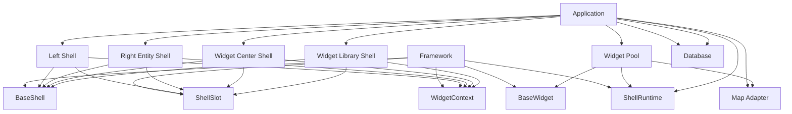
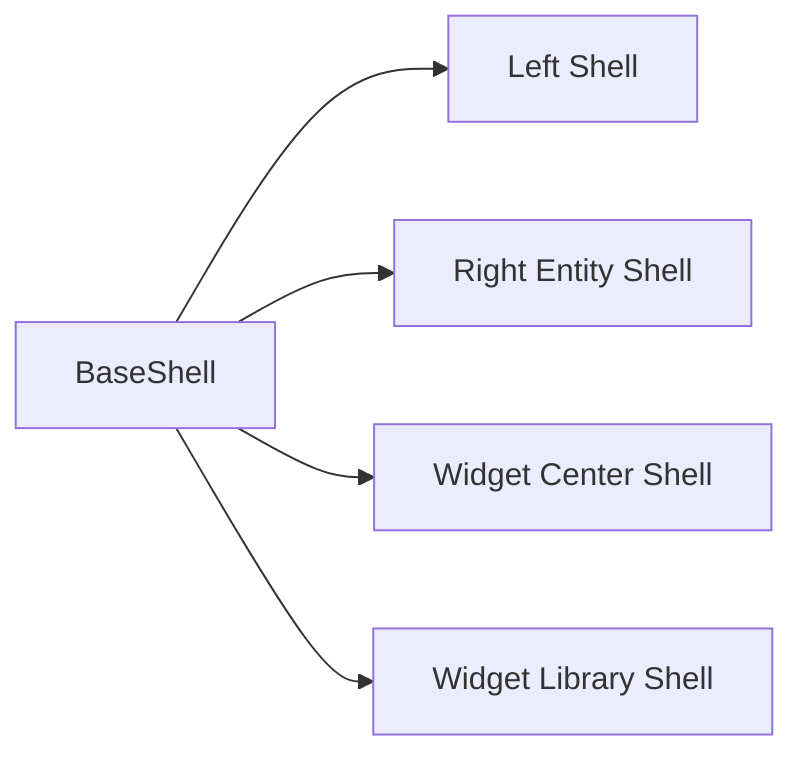
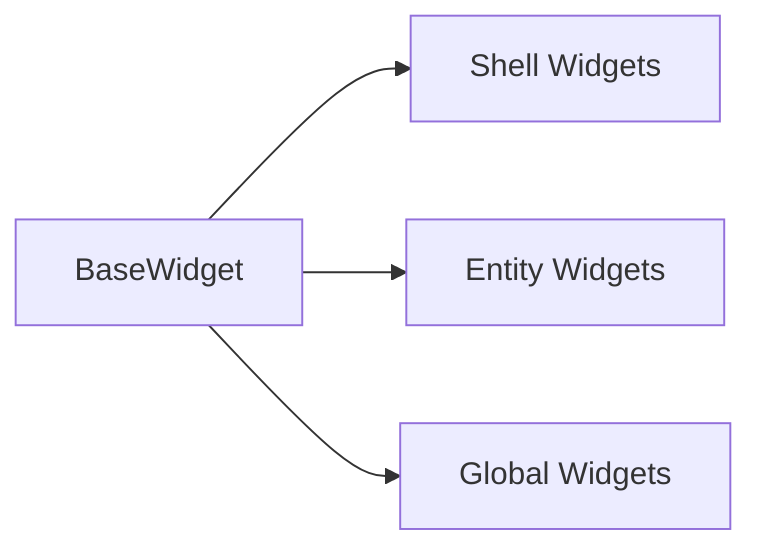
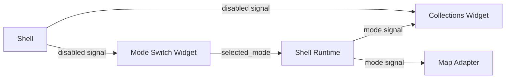
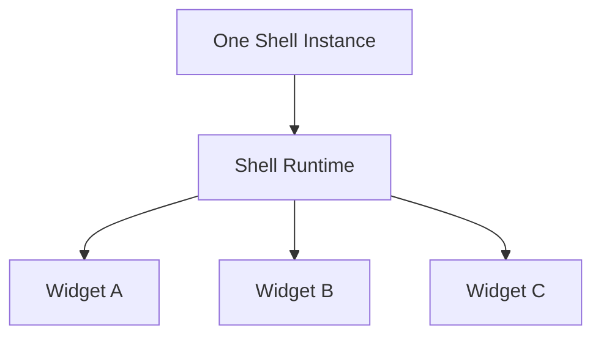
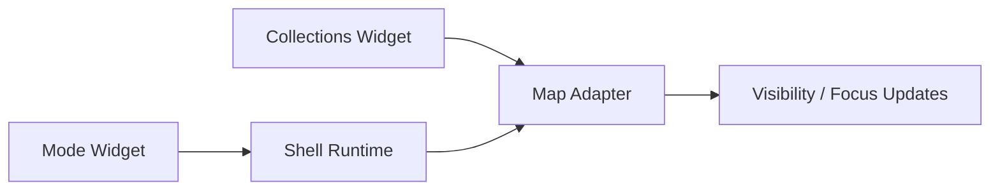
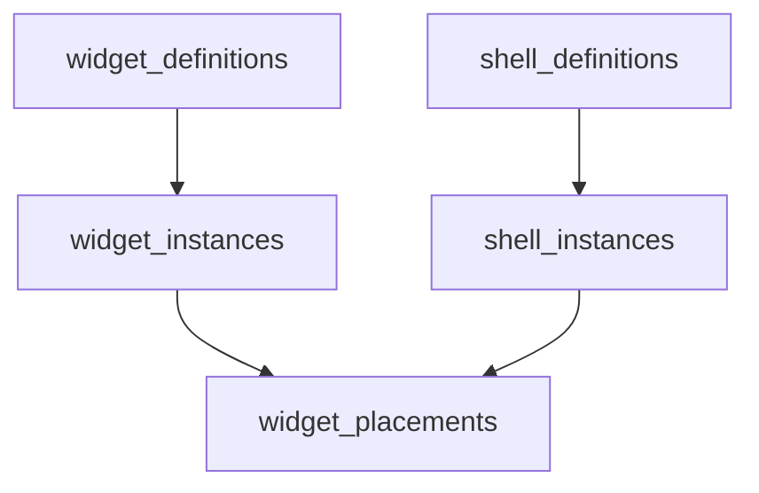
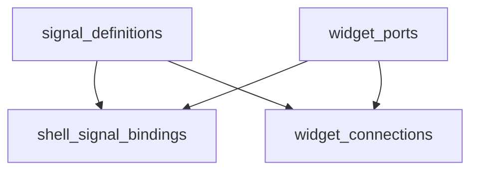
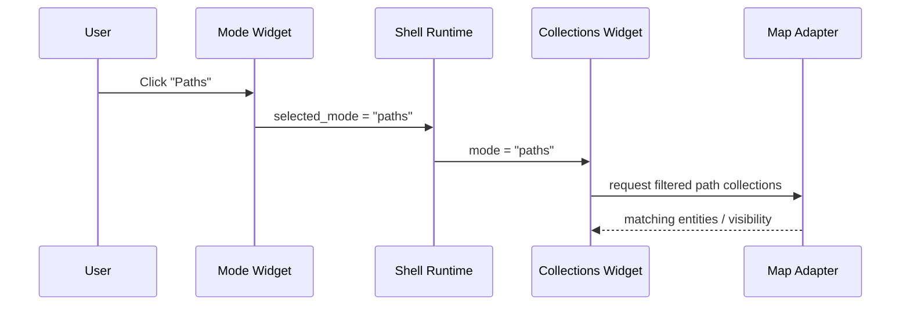

# Framework Blueprint

This file is the single high-level map of the application framework.

It describes:

1. what the framework is
2. what the application is
3. how shells, widgets, signals, map adapters, and the database relate
4. what is generic
5. what is application-specific

---

## 1. Human Model

The whole system should be understood like physical equipment.

- `Shell` = panel / rack / surface
- `Widget` = instrument / device
- `Signals` = wires
- `Connections` = explicit wiring
- `Map Adapter` = another device the app can connect to
- `App` = the orchestrator that decides how things are connected

The framework itself does **not** know the product.
It only knows how panels, widgets, and signals work in general.

---

## 2. The Big Picture


```mermaid
flowchart TD
  F["Framework"] --> BS["BaseShell"]
  F --> BW["BaseWidget"]
  F --> RT["ShellRuntime"]
  F --> SL["ShellSlot"]
  F --> WC["WidgetContext"]

  APP["Application"] --> LS["Left Shell"]
  APP --> RS["Right Entity Shell"]
  APP --> WS["Widget Center Shell"]
  APP --> LIB["Widget Library Shell"]

  APP --> WP["Widget Pool"]
  APP --> MAP["Map Adapter"]
  APP --> DB["Database"]

  LS --> BS
  RS --> BS
  WS --> BS
  LIB --> BS

  WP --> BW
  WP --> RT
  WP --> MAP

  LS --> SL
  RS --> SL
  WS --> SL
  LIB --> SL

  LS --> WC
  RS --> WC
  WS --> WC
  LIB --> WC

  APP --> RT
  APP --> DB
```

---

## 3. Main Rule

There are only two worlds.

### Framework world

Generic reusable atoms:

1. `BaseShell`
2. `BaseWidget`
3. `ShellRuntime`
4. `ShellSlot`
5. `WidgetContext`

### Application world

Concrete product composition:

1. left shell
2. right entity shell
3. widget center shell
4. widget library shell
5. collections widget
6. mode switch widget
7. map controls widget
8. rating widget
9. gallery widget
10. any future widget

Application code must **compose** framework atoms.
It must not invent parallel base systems.

---

## 4. Shell Model

`BaseShell` is the generic panel.

It knows only:

1. open / close
2. placement
3. motion
4. backdrop
5. scroll region
6. header region

It does **not** know:

1. pins
2. paths
3. collections
4. ratings
5. map business logic
6. product meaning of signals

### Concrete shells


```mermaid
flowchart LR
  BS["BaseShell"] --> L["Left Shell"]
  BS --> R["Right Entity Shell"]
  BS --> W["Widget Center Shell"]
  BS --> G["Widget Library Shell"]
```

Each concrete shell is only a specialization:

- title
- subtitle
- placement
- size
- allowed widget policies
- shell-specific orchestration

---

## 5. Widget Model

`BaseWidget` is the generic instrument.

It knows only:

1. frame
2. header
3. settings
4. host shell selector UI
5. standard shell-native behavior

It does **not** know:

1. where it will always live
2. what product it belongs to
3. what other widgets exist
4. what a signal means in product terms

### Concrete widgets


```mermaid
flowchart LR
  BW["BaseWidget"] --> SW["Shell Widgets"]
  BW --> EW["Entity Widgets"]
  BW --> GW["Global Widgets"]
```

Examples:

- shell widgets:
  - search
  - mode switch
  - collections
  - controls
  - create collection
  - reset view
- entity widgets:
  - info
  - delete
  - rating
  - gallery
  - stories
  - resources
  - nearby pins
  - transport mode
- global widgets:
  - widget center cards
  - future dashboard widgets

---

## 6. One Species of Widget

There are not two biological kinds of widgets.

All widgets are one species.

Every widget should already know how to:

1. live inside a shell
2. be dragged by shell slot logic
3. be disabled by shell signals
4. open settings
5. read shell-native context

The difference is not in what widget **is**.

The difference is in how much extra orchestration it needs.

### Example

`rating`:
- can mostly live by standard shell behavior

`mode switch`:
- still the same species of widget
- but it becomes useful only when the app connects its signals to something meaningful

---

## 7. Signals

Signals are the wires.

They are generic values passed through shell runtime and connections.

Examples:

- `shell.disabled`
- `shell.hidden`
- `shell.mode`
- `shell.collection_query`
- `map.focus_entity`

### Signal flow


```mermaid
flowchart LR
  A["Mode Switch Widget"] -- "selected_mode" --> B["Shell Runtime"]
  B -- "mode signal" --> C["Collections Widget"]
  B -- "mode signal" --> D["Map Adapter"]
  E["Shell"] -- "disabled signal" --> A
  E -- "disabled signal" --> C
```

The key idea:

- widgets can emit signals
- widgets can consume signals
- shell can emit signals
- map adapter can consume and emit signals
- the app decides how they are connected

---

## 8. Two Levels of Widget Behavior

Every widget works on two levels.

### Level 1: shell-native behavior

Comes from the framework automatically:

1. host awareness
2. settings open/close
3. disable state
4. drag / reorder compatibility
5. shell lifecycle compatibility

### Level 2: product scenario behavior

Comes from application orchestration:

1. button 1 means `pins`
2. button 2 means `paths`
3. signal from widget A goes to widget B
4. signal from widget B goes to map
5. shell chooses who is locked during authoring flow

This second level is not framework logic.
This is application composition.

---

## 9. Shell Runtime

`ShellRuntime` is the shared local bus inside one shell.

It holds:

1. shell-scoped signals
2. shell-scoped state
3. shell capabilities
4. widget element registration
5. scroll targeting

It is local per shell.

That means:

- left shell has its own runtime
- right shell has its own runtime
- widget center has its own runtime
- library shell has its own runtime


```mermaid
flowchart TD
  S["One Shell Instance"] --> R["Shell Runtime"]
  R --> W1["Widget A"]
  R --> W2["Widget B"]
  R --> W3["Widget C"]
```

---

## 10. Shell Slot

`ShellSlot` is the generic place where a widget is mounted inside a shell.

It owns:

1. drag affordance
2. drop target behavior
3. reorder visuals
4. shell-owned drag geometry

It does **not** belong to widgets.

Widgets should not reimplement drag/drop.

---

## 11. Widget Context

`WidgetContext` is shell-owned widget metadata.

Examples:

1. current host shell
2. allowed host options
3. whether host selection is locked
4. optional host change callback

This is not widget business logic.
This is shell-to-widget context.

---

## 12. Map Adapter

The map is a separate integration device.

It should be treated like another system with inputs and outputs.

The framework should not hardcode map meaning into `BaseWidget` or `BaseShell`.

Instead:

- app widgets can connect to a map adapter
- app shells can also publish signals the map listens to


```mermaid
flowchart LR
  CW["Collections Widget"] --> MA["Map Adapter"]
  MW["Mode Widget"] --> SR["Shell Runtime"]
  SR --> MA
  MA --> VW["Visibility / Focus Updates"]
```

---

## 13. Database Model

The backend must mirror the same framework model.

### Core records


```mermaid
flowchart TD
  WD["widget_definitions"] --> WI["widget_instances"]
  SD["shell_definitions"] --> SI["shell_instances"]
  WI --> WP["widget_placements"]
  SI --> WP
```

This answers:

1. what widget is this
2. what shell is this
3. where is the widget placed

### Signal records


```mermaid
flowchart TD
  SG["signal_definitions"]
  PT["widget_ports"]
  SB["shell_signal_bindings"]
  CN["widget_connections"]

  SG --> SB
  PT --> SB
  PT --> CN
  SG --> CN
```

This answers:

1. what signals exist
2. what ports widgets have
3. what shell-native auto-connections exist
4. what explicit widget-to-widget connections exist

### Why the DB needs this

Without this, the DB only knows:

1. what exists
2. where it is

With this, the DB also knows:

1. what can talk
2. what can listen
3. what is auto-wired
4. what is manually connected

That is the difference between:

1. layout storage
2. true framework composition storage

---

## 14. What the App Orchestrator Does

The app is the conductor.

It decides:

1. what shells exist
2. what widgets go in each shell
3. what widgets are movable
4. what widgets are locked
5. what signals are connected
6. what map integrations are used

It does not reinvent framework atoms.

It only composes them.

---

## 15. Concrete Example

Scenario:

1. `Mode Switch Widget`
2. `Collections Widget`
3. `Map Adapter`
4. `Left Shell`

Flow:


```mermaid
sequenceDiagram
  participant U as User
  participant M as Mode Widget
  participant R as Shell Runtime
  participant C as Collections Widget
  participant MAP as Map Adapter

  U->>M: Click "Paths"
  M->>R: selected_mode = "paths"
  R->>C: mode = "paths"
  C->>MAP: request filtered path collections
  MAP-->>C: matching entities / visibility
```

This is the key architectural point:

- the widget is generic
- the shell is generic
- the app gives the meaning of the connection

---

## 16. Folder Rule

Framework atoms must never be hidden inside widget pool folders.

Correct:

- `src/framework/*`
- `src/components/widgets/*` for concrete product widgets
- `src/components/shells/*` for concrete product shells

Incorrect:

- putting the main framework widget inside the ordinary widget pool
- putting the main shell atom inside one product shell folder

---

## 17. Current Canonical Entry

Framework atoms are package-owned:

1. `@synarava/shell-kit` owns `BaseShell`, `BaseWidget`, `ShellSlot`, widget chrome, motion, and reorder behavior.
2. `@synarava/liquid-glass` owns glass materials and visual effects.
3. Published `@synarava/wiring-engine` owns signals, ports, widget definitions, and wiring; its source lives in `/Users/kirylkrystsia/WebstormProjects/synarava-wiring-engine`.

Visit All owns product composition in `src/framework/wiring` and app adapters that connect generic signals to domain contexts.

---

## 18. Immediate Direction

To keep architecture strict, the next moves should be:

1. finish replacing product signal reads/writes with wiring-engine ports
2. keep `ShellRuntimeProvider` only for shell-kit layout APIs until shell-kit delegates it to wiring-engine
3. register the remaining app widgets through `WidgetDefinition`
4. remove confirmed dead parallel shell/widget implementations
5. stabilize BaseWidget stories and design tokens before AI widget generation

That is the path toward a real reusable framework instead of a growing pile of custom panels.

---

## 19. Package Architecture (Multi-App Framework Vision)

The long-term goal is a reusable framework that other applications can build on.
This section defines the canonical package structure and the missing pieces.

### 19.1 Package Pyramid

```
Level 0 — Foundation (no synarava deps)
  @synarava/liquid-glass       visual materials, glass surfaces, animations

Level 1 — Primitives (depends on liquid-glass)
  @synarava/shell-kit          BaseShell, BaseWidget, ShellSlot, DnD
                               NOTE: ShellRuntime must be migrated to use
                               @synarava/wiring-engine bus in next version

Level 2 — Signal Bus (depends on react + zustand only)
  @synarava/wiring-engine      Zustand signal bus + WiringConfig + PortDefinition
                               + WidgetDefinition contract + defineWidget()
                               This is the core of the framework.

Level 3 — Application (depends on all above)
  app widgets                  implement WidgetDefinition from wiring-engine
  app shells                   extend BaseShell from shell-kit
  app wiring config            WiringConfig with app-specific SystemBindings
  AI widget generator          generates WidgetDefinition-conformant components
```

### 19.2 The WidgetDefinition Contract

This is the missing piece that makes AI generation possible.

Every widget — human-written or AI-generated — must implement this interface:

```ts
interface WidgetDefinition {
  key: string                        // unique stable identifier
  name: string                       // human-readable label
  ports: PortDefinition[]            // signal inputs and outputs
  Component: React.ComponentType     // the UI
  configSchema?: JSONSchema           // config AI can fill in
  defaultConfig?: Record<string, unknown>
}
```

When every widget declares its ports, the WiringEngine can:
1. Auto-wire signals without hardcoded keys
2. Show available connections in the Patch Bay devtool
3. Let AI generate new widgets that integrate without code changes

### 19.3 defineWidget() Helper

```ts
// Any widget — human or AI-generated — registers itself like this:
export const SearchWidgetDefinition = defineWidget({
  key: "shell_search",
  name: "Search",
  ports: [
    { portKey: "query_out", direction: "output", valueType: "string", label: "Query" },
  ],
  Component: ShellSearchWidget,
})
```

The framework receives a `WidgetDefinition` and can:
- Mount it in a ShellSlot
- Connect its ports via WiringEngine
- Display it in the Widget Library panel

### 19.4 AI Generation Path

When the AI widget generation system is added:

```
User describes intent → AI generates WidgetDefinition → defineWidget() validates contract
→ WidgetRegistry.register() adds it → app uses it like any other widget
```

AI does not generate free-form components.
AI generates conformant WidgetDefinition objects.
The contract is the interface between human intent and the framework.

### 19.5 Standalone Status of wiring-engine

The package currently lives in this workspace and is consumed through npm workspaces.
Publishing is intentionally deferred until the consumer migration proves the public API.

wiring-engine has no DOM dependencies, no shell-kit dependency, no Next.js dependency.
It is `zustand` + `react` only.
It is cross-platform: web, React Native, Electron.

### 19.6 Shell-kit Migration Required

shell-kit currently uses a custom `ShellRuntime` (useState + React context).
In the next published version, ShellRuntime must be replaced with wiring-engine's bus.

This means:
- shell-kit adds `@synarava/wiring-engine` as a dependency
- `ShellRuntimeProvider` becomes a thin wrapper over `SignalBusProvider`
- `useShellRuntimeValue` / `useShellRuntimeActions` delegate to wiring-engine hooks
- External API stays identical — no breaking change for apps

### 19.7 What Another App Gets

An app built on this framework:

```ts
import { SignalBusProvider, WiringEngineProvider, defineWidget } from "@synarava/wiring-engine"
import { BaseShell, BaseWidget, ShellSlot } from "@synarava/shell-kit"
import { LiquidGlassSurface } from "@synarava/liquid-glass"

// 1. Define widgets (or use AI-generated ones)
const MyWidget = defineWidget({ key: "my_widget", ports: [...], Component: MyComp })

// 2. Configure wiring
const config = { shellId: "main", systemBindings: MY_BINDINGS, userConnections: [] }

// 3. Compose the shell
function MyApp() {
  return (
    <WiringEngineProvider busId="main" config={config}>
      <BaseShell>
        <ShellSlot><MyWidget.Component /></ShellSlot>
      </BaseShell>
    </WiringEngineProvider>
  )
}
```

No knowledge of the host app required.
Widgets are composable, portable, and AI-generatable.

---

## 20. Immediate Next Steps (Framework Completion)

Priority order:

1. Continue migrating Visit All product signals and widget contracts to the published wiring-engine package.
2. Register all product widgets through `WidgetDefinition` and one app registry.
3. Put BaseWidget stories and shared design tokens in order.
4. Migrate shell-kit `ShellRuntime` internals to wiring-engine while preserving shell-kit layout APIs.
5. Keep `visit-all` pinned to the proven published `@synarava/wiring-engine` version and release package changes independently.
6. Add Figma Code Connect.
7. Keep `@synarava/widget-generator` releases independent and evolve its prompt/runtime contracts only through published versions.


---

## 21. AI Widget Builder

See **[WIDGET_BUILDER_PLAN.md](./WIDGET_BUILDER_PLAN.md)** for the full implementation plan.

Summary:
- Published package `@synarava/widget-generator@0.1.0` — generation context, Claude prompt contracts, response parsing, and browser JSX executor
- Source repository: `/Users/kirylkrystsia/WebstormProjects/synarava-widget-generator`; Visit All consumes the exact GitHub Packages version rather than workspace source
- New app module `src/modules/widget-builder/` — full-width AI chat shell + live widget preview
- Widget Center reworked — interactive pool cards, fast preloading, "Create Widget" entry point
- Generated widgets are first-class `WidgetDefinition` objects — same ports, same wiring, same Patch Bay visibility
- `COMPONENT_CATALOG` from `@synarava/ui-kit` is the bot's API surface for UI primitives
