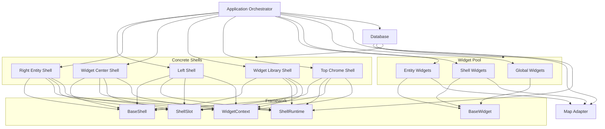
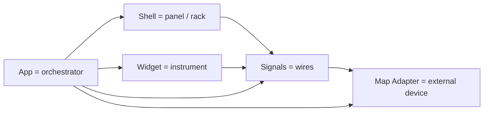
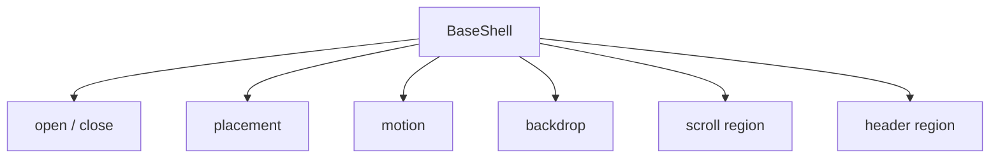
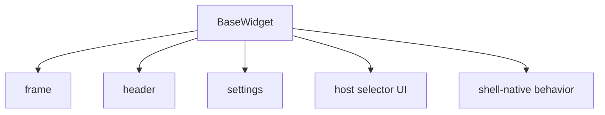
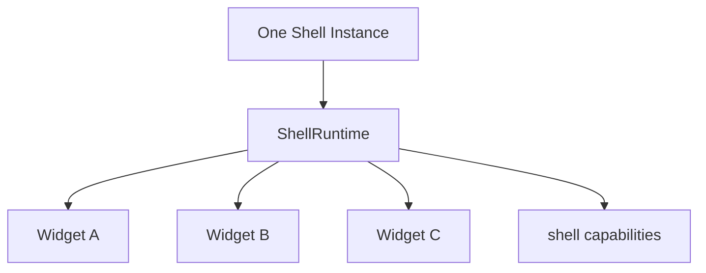
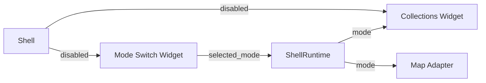
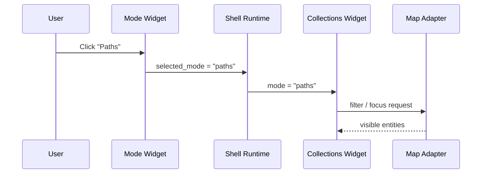
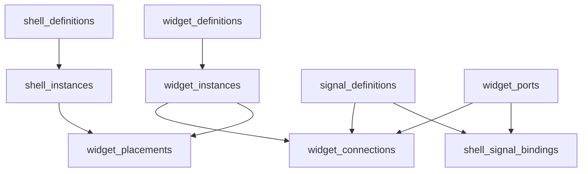
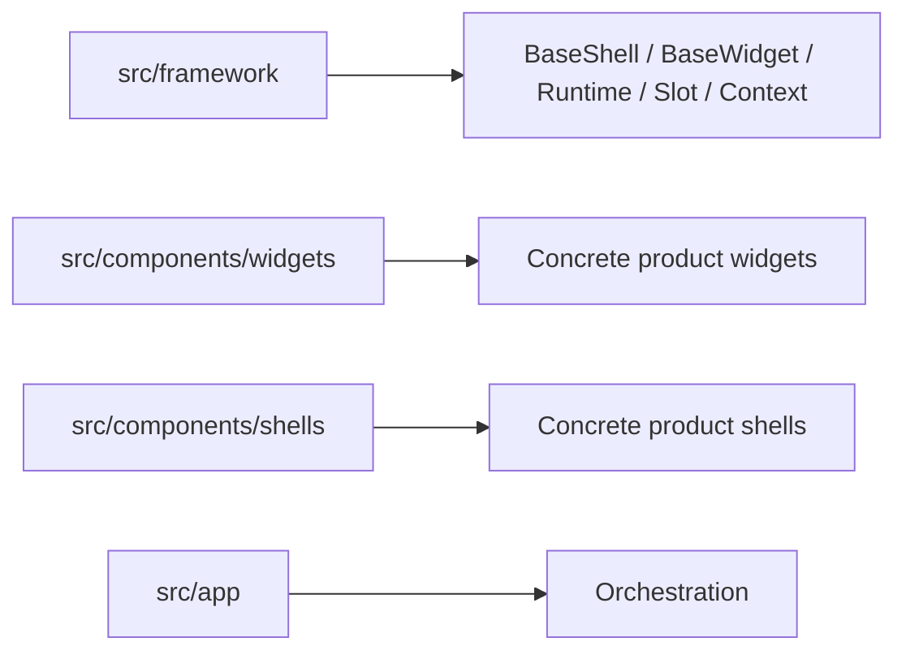

# Framework Diagram

## 1. Full System

## 2. Mental Model

## 3. What BaseShell Owns

## 4. What BaseWidget Owns

## 5. Runtime Inside One Shell

## 6. Signal Example

## 7. Real Product Example

## 8. Backend Model

## 9. Folder Rule

