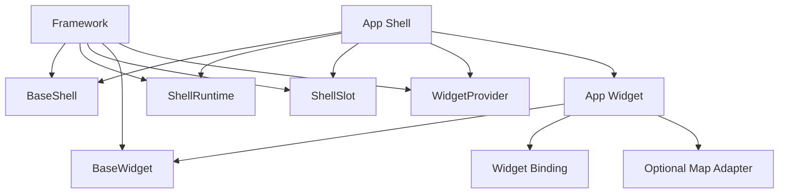
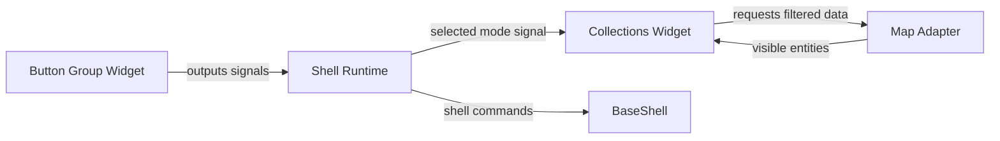

# Framework Architecture

## Goal

The application must be built from one reusable framework layer.

The framework does not know the product.
The framework only knows:

1. widgets
2. shells
3. shell runtime
4. shell slotting / ordering
5. widget host metadata
6. signal wiring points

The backend must eventually know these things too.

That means the database should know:

1. widget library records
2. shell records
3. widget placement records
4. signal definitions
5. widget ports
6. auto shell bindings
7. explicit widget connections

Application code becomes an orchestrator that composes these pieces.

## Human Model

Forget framework jargon for a second.

This system is:

1. `shell` = panel / rack / surface
2. `widget` = instrument / device
3. `signals` = wires
4. `connections` = how the orchestrator connects wires

Important:

- all widgets are the same species
- every widget already knows how to live inside a shell
- some widgets are useful immediately
- some widgets only become useful after extra signal connections

That does **not** mean we have two widget species.

It means:

- one `BaseWidget`
- some widgets use only standard shell signals
- some widgets also use extra app connections

## Canonical Code Home

The framework entrypoint lives in:

`src/framework`

Canonical atoms:

1. `src/framework/widgets/BaseWidget.tsx`
2. `src/framework/widgets/WidgetContext.tsx`
3. `src/framework/shells/BaseShell.tsx`
4. `src/framework/shells/ShellRuntime.tsx`
5. `src/framework/shells/ShellSlot.tsx`

Concrete application code should treat these as the only public framework surface.

## Naming

`WidgetChrome` was the implementation name for the base widget skin.

The canonical framework name is now:

- `BaseWidget`

`ShellSurface` was the implementation name for the base shell container.

The canonical framework name is now:

- `BaseShell`

## Layer Model



## Wiring Model

The mental model is a rack with instruments and wires.

- shell = rack
- widget = instrument
- shell runtime = local signal bus
- bindings = wiring
- map adapter = another external device



## Practical Rule

Every widget should work on two levels.

### Level 1: shell-native behavior

This should come for free from the framework:

1. live inside a shell
2. be dragged
3. be disabled
4. open settings
5. know its host shell
6. respond to shell lifecycle

### Level 2: app scenario behavior

This is where the application connects meaning:

1. button 1 means `pins`
2. button 2 means `paths`
3. one widget changes a shell signal
4. another widget listens to that signal
5. map adapters can listen too

This second level is orchestration.
It should not be baked into the framework atoms.

## Responsibilities

### BaseWidget

Knows only:

1. widget frame
2. widget header
3. settings panel
4. host selector UI

Does not know:

1. maps
2. collections
3. pins
4. paths
5. business meaning of signals

### BaseShell

Knows only:

1. shell placement
2. shell motion
3. shell backdrop
4. shell header
5. scroll region

Does not know:

1. what widget signals mean
2. what map events mean
3. what app mode means

### ShellRuntime

Knows only:

1. signal state
2. signal mutation
3. shell capabilities
4. widget registration
5. scroll targeting

Does not know:

1. product semantics
2. map semantics
3. visual widget content

### App Widget

Knows only:

1. its own content
2. its own config
3. its own input/output contract
4. its own optional feature adapters

Does not know:

1. where it will be hosted forever
2. what other widgets exist
3. what the shell will do with its signals

## Minimal React Example

This is the intended mental model in the smallest possible form.

```tsx
"use client";

import { createContext, useContext, useMemo, useState } from "react";

type Signals = {
  mode: "pins" | "paths" | "zones";
  disabled: boolean;
};

type ShellBus = {
  signals: Signals;
  setSignal: <K extends keyof Signals>(key: K, value: Signals[K]) => void;
};

const ShellBusContext = createContext<ShellBus | null>(null);

const useShellBus = () => {
  const value = useContext(ShellBusContext);
  if (!value) throw new Error("Missing shell bus");
  return value;
};

const BaseShell = ({
  children,
  initialSignals,
}: {
  children: React.ReactNode;
  initialSignals: Signals;
}) => {
  const [signals, setSignals] = useState(initialSignals);

  const bus = useMemo(
    () => ({
      signals,
      setSignal: (key, value) =>
        setSignals((current) => ({ ...current, [key]: value })),
    }),
    [signals]
  );

  return (
    <ShellBusContext.Provider value={bus}>
      <div>{children}</div>
    </ShellBusContext.Provider>
  );
};

const BaseWidget = ({ children }: { children: React.ReactNode }) => {
  return <section>{children}</section>;
};

const ModeWidget = () => {
  const { signals, setSignal } = useShellBus();

  return (
    <BaseWidget>
      <button onClick={() => setSignal("mode", "pins")} disabled={signals.disabled}>
        Pins
      </button>
      <button onClick={() => setSignal("mode", "paths")} disabled={signals.disabled}>
        Paths
      </button>
      <button disabled>Zones</button>
    </BaseWidget>
  );
};

const CollectionsWidget = () => {
  const { signals } = useShellBus();

  return <BaseWidget>Filtering by: {signals.mode}</BaseWidget>;
};
```

Read it like this:

1. `BaseShell` gives the shared shell bus
2. `ModeWidget` writes a signal
3. `CollectionsWidget` reads that signal
4. both widgets are still just widgets
5. the app decides what those signals mean

## Concrete Composition Rule

When implementing a product shell:

1. take `BaseShell`
2. add `ShellRuntimeProvider`
3. add `WidgetProvider`
4. place widgets using `ShellSlot`
5. connect bindings

When implementing a product widget:

1. take `BaseWidget`
2. define config
3. define inputs
4. define outputs
5. optionally connect external adapters like map or uploads

## Current Product Mapping

Today the app should converge to:

1. left panel = `BaseShell` specialization
2. right entity panel = `BaseShell` specialization
3. widget center = `BaseShell` specialization
4. widget library = `BaseShell` specialization

And:

1. shell widgets = `BaseWidget` specializations
2. entity widgets = `BaseWidget` specializations
3. global widgets = `BaseWidget` specializations

## Rule For Future Work

Never place framework atoms inside a widget pool folder as if they were ordinary widgets.

The framework is always separate.

The widget pool consumes the framework.

## Backend Reality

The framework is not only a React composition layer.

It also needs a backend model that can answer:

1. what widget is this
2. where does it live
3. what signals can it emit
4. what signals can it consume
5. what is auto-connected by the framework
6. what is explicitly connected by the application

Current database foundation for this direction now includes:

1. `widget_definitions`
2. `widget_instances`
3. `shell_definitions`
4. `shell_instances`
5. `widget_placements`
6. `signal_definitions`
7. `widget_ports`
8. `shell_signal_bindings`
9. `widget_connections`

## Immediate Direction

The project should now move in this order:

1. keep framework atoms discoverable in `src/framework`
2. make every product shell consume `BaseShell`
3. make every product widget consume `BaseWidget`
4. keep shell signals generic
5. move product meaning into orchestration and connections
6. avoid introducing new parallel base layers
